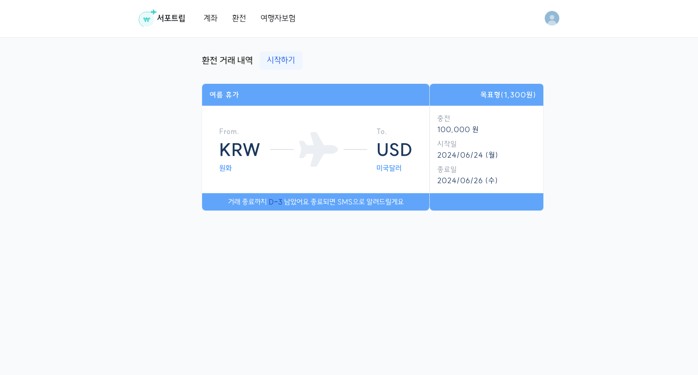
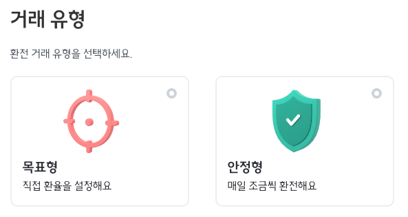
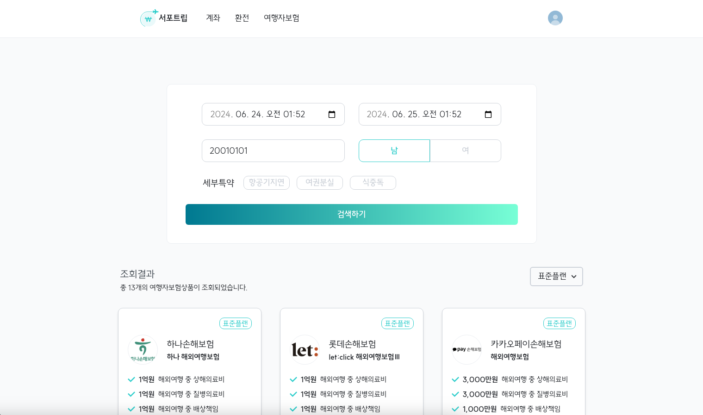
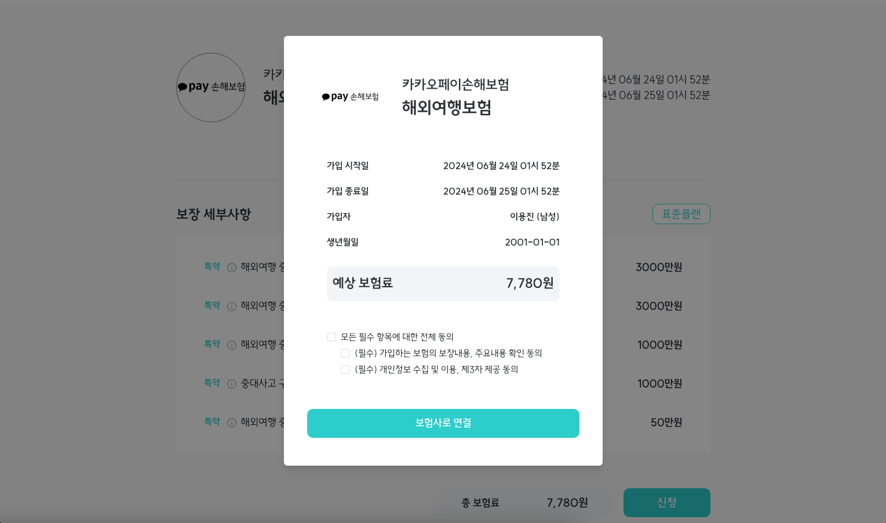
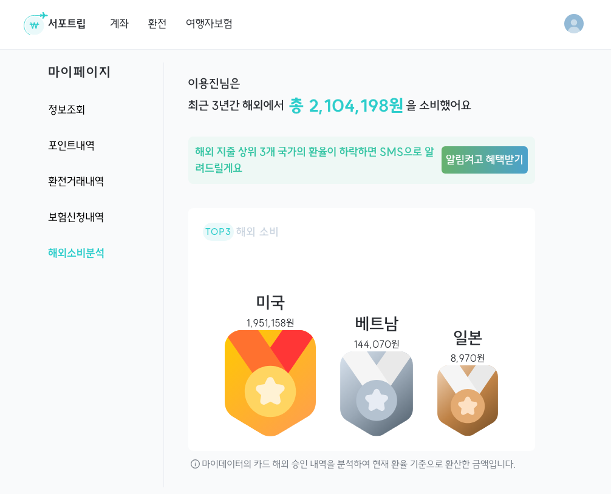

# ✈️ 우리의 여행 비서, 서포트립

### 해외 여행자들을 위한 자동 환전 & 마이데이터 기반 사용자 맞춤형 서비스

#### 🏆 우리FISA 최종 프로젝트 최우수상

 

## 서버 아키텍처

  

## 기술 스택

### Backend

### Frontend

 

## 서비스 기능

### 1. 자동 환전

- 환전 거래를 생성해놓으면, 거래 종료 당일까지 월~금에 매일 1번 환전 거래 유형에 따라 자동 환전 프로세스가 진행됩니다.
  (실제 시중 은행 API를 활용하여 환전이 실행되는 것이 아니라, 저희 서비스 자체적으로 환전 기능을 구현하였습니다)
  
   

- 환전 거래 유형은 **목표형**과 **안정형** 두 가지 타입이 존재합니다.
- **목표형**: 설정한 환율에 도달했을때 자동으로 모두 환전합니다.
- **안정형**: 매일 조금씩 환전하며, 환전 종료시 환전 시작 시점 환율과 비교하여 손해가 발생했다면 차액만큼 포인트로 보상해줍니다.
  
   

### 2. 여행자 보험 조회 & 신청

- **여행자 보험들을 조회**할 수 있으며, **특정 조건에 따라 검색**할 수 있습니다.
- 로그인 없이도 여행자 보험을 조회 및 검색이 가능합니다.
  (_아래 예시 그림의 모든 여행자 보험 상품들은 저희가 임의로 만든 가상의 상품입니다_)
  
   

- 로그인 후 해당 여행자 보험 상세 정보 조회에서 보험사 사이트로 이동하여 보험 가입을 진행할 수 있습니다.
  (_아래 예시 그림의 여행자 보험 상품은 저희가 임의로 만든 가상의 상품입니다_)
  
   

### 3. 해외 지출 분석 & 리마인드 SMS 알람

- 마이데이터 서버로부터 해외 결제 내역을 조회하여 해외 지출을 분석한 정보를 조회할 수 있습니다.
  (실제 마이데이터 서버를 이용할 수 없어, 마이데이터 API 명세를 지키고 유저 CI를 도입하여 자체 구축한 마이데이터 더미 서버를 이용해 구현하였습니다)
  
   

- 유저의 이용률을 높이기 위해 해외 지출 상위 3개 국가의 현재 환율이 이전 3개월보다 작을 경우 리마인드 SMS를 보내도록 구현하였습니다.
   

## 프로젝트 팀원 소개

|                     [박은혜](https://github.com/eheh10) (팀장)                     |                                     [김태혁](https://github.com/rlaxoqkf)                                      |                                [이용진](https://github.com/yjlee0235)                                |                           [안성민](https://github.com/zzzdks760)                            |
| :--------------------------------------------------------------------------------: | :------------------------------------------------------------------------------------------------------------: | :--------------------------------------------------------------------------------------------------: | :-----------------------------------------------------------------------------------------: |
|           |                                       |                              |                     |
| 환전 내역 관리 풀스택 개발 해외 지출 분석 풀스택 개발 마이데이터 서버 구축 | 외화 계좌 관리 풀스택 개발 마이페이지 풀스택 개발 여행자보험 추천 풀스택 개발 마이데이터 서버 구축 | 카카오 OAuth2 인증 개발 회원 가입 풀스택 개발 환율 Open API 연동 자동 환전 프로세스 개발 | 해외여행보험 검색 풀스택 개발 해외여행보험 신청 풀스택 개발 관리자 기능 풀스택 개발 |
